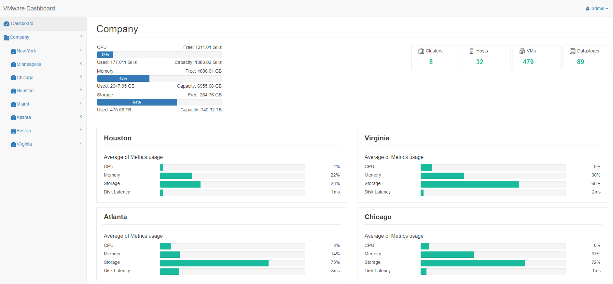

VMware Dashboard
------------------

This application will help you understand how you are using the resources in your VMware infrastructure and identity performance issues. 

 The application was built with Django and uses the libraries [plotly](https://plot.ly/graphing-libraries/) for the graphs and [pyVmomi](https://github.com/vmware/pyvmomi) to connect to the vCenter Server API. 
 
 Before running the application, please go to the file [perfdata.py](application/lib/perfdata.py) line #26 and write the credentials for a vCenter read-only user. 
 ```
 self.c = SmartConnect(host="", user="", pwd="", sslContext=s)
 ```
 
 When you first load the application you will have a general view of your infrastrcuture. 

 
