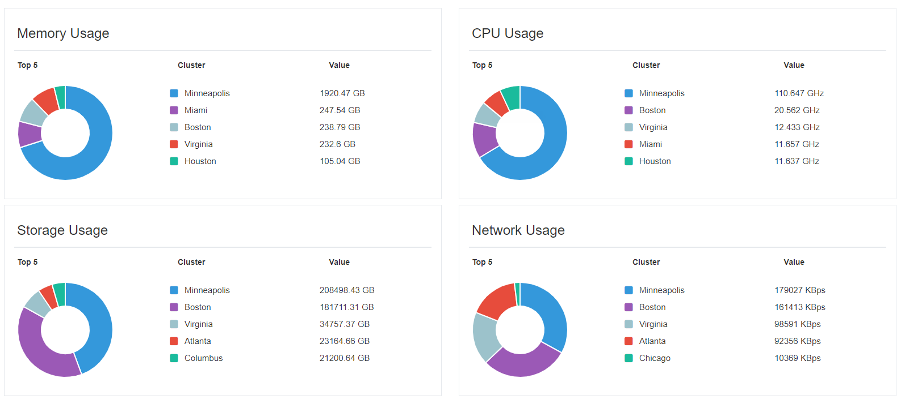
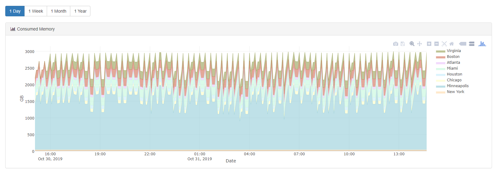
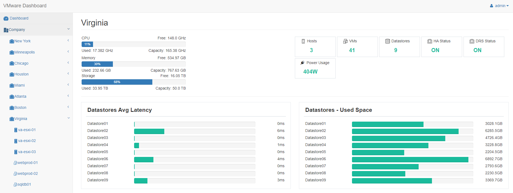
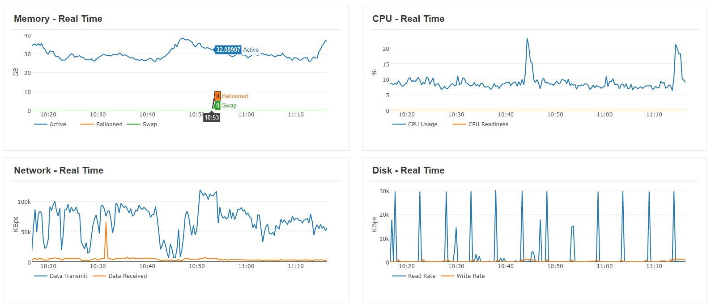
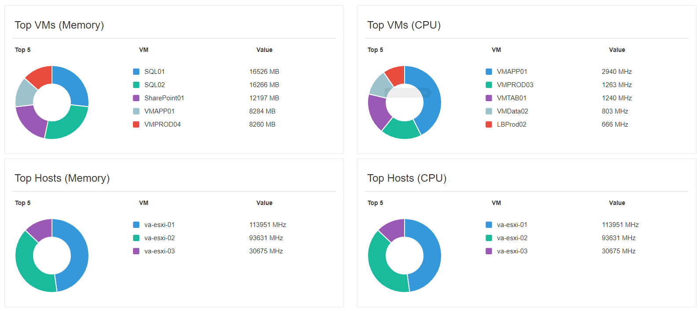
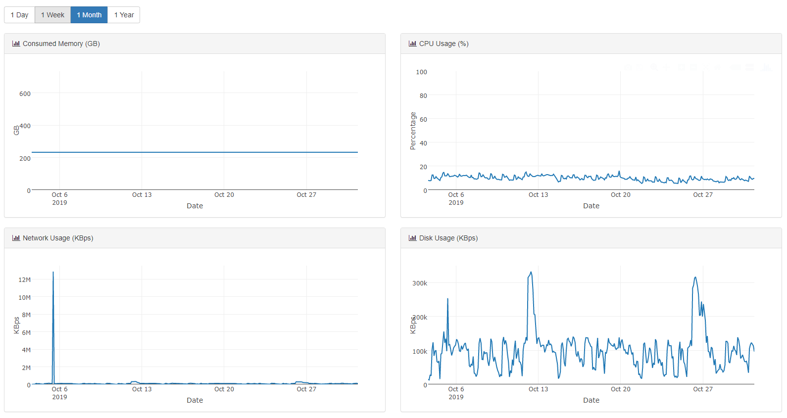
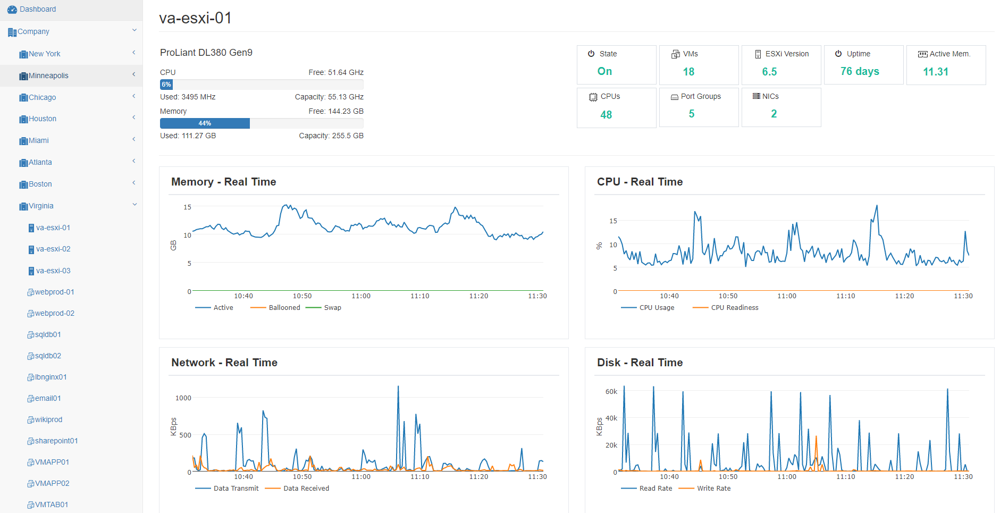
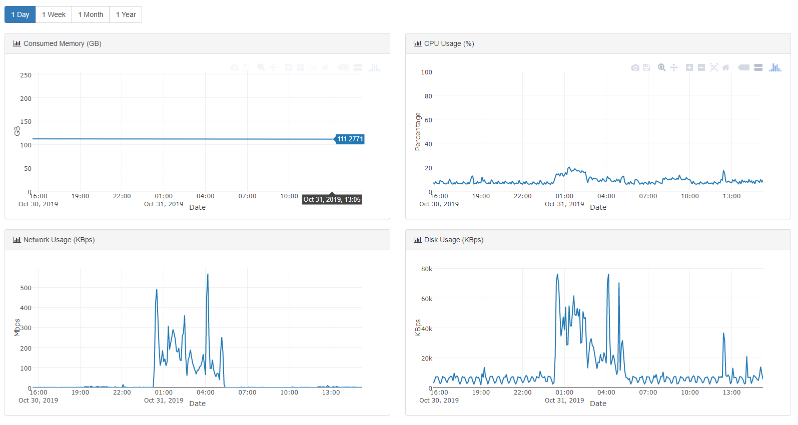

VMware Dashboard
------------------

This application will help you understand how you are using the resources in your VMware infrastructure and identity performance issues. 

 The application was built with Django and uses the libraries [plotly](https://plot.ly/graphing-libraries/) for the graphs and [pyVmomi](https://github.com/vmware/pyvmomi) to connect to the vCenter Server API. 
 
 Before running the application, please go to the file [perfdata.py](application/lib/perfdata.py) line #26 and write the credentials for a vCenter read-only user. 
 ```
 self.c = SmartConnect(host="vcenter_IP", user="user@vsphere.local", pwd="Password", sslContext=s)
 ```
 
 When you first load the application you will have a general view of the resources in your infrastrcuture 

 

You can see the clusters that are using more resources in your company 



Historical metrics reports for memory, CPU and storage




---

On the left sidebar you can click on a cluster to analyze its performance and usage 



In the real time graphs you can also identify if there are performance issues in the cluster 



The donaught charts show the VMs using more resources in the cluster



Historical metrics and trends in the cluster



---

ESXi hosts view



Trends



---

VM View


